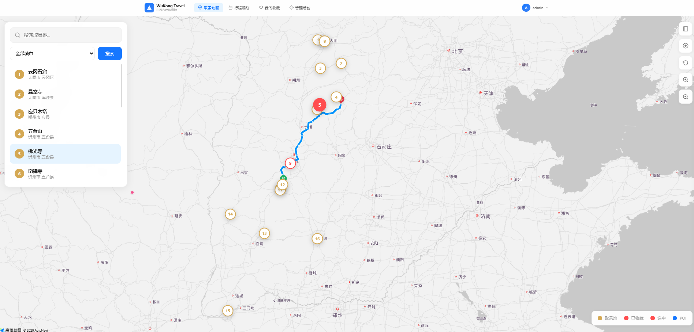
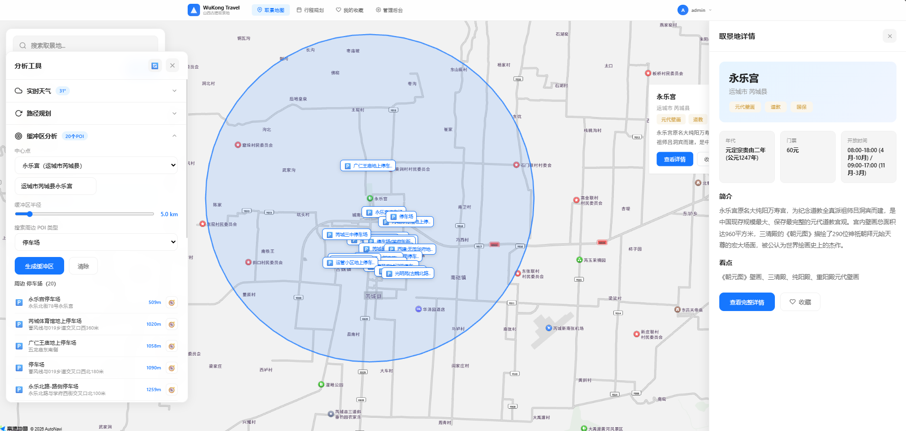
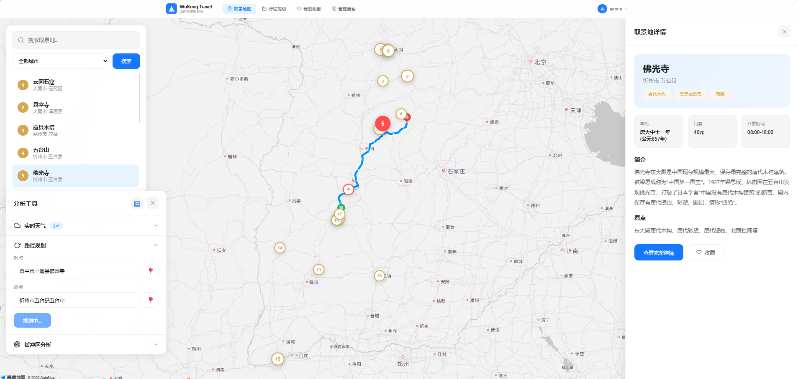
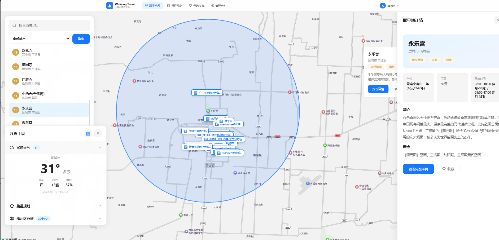
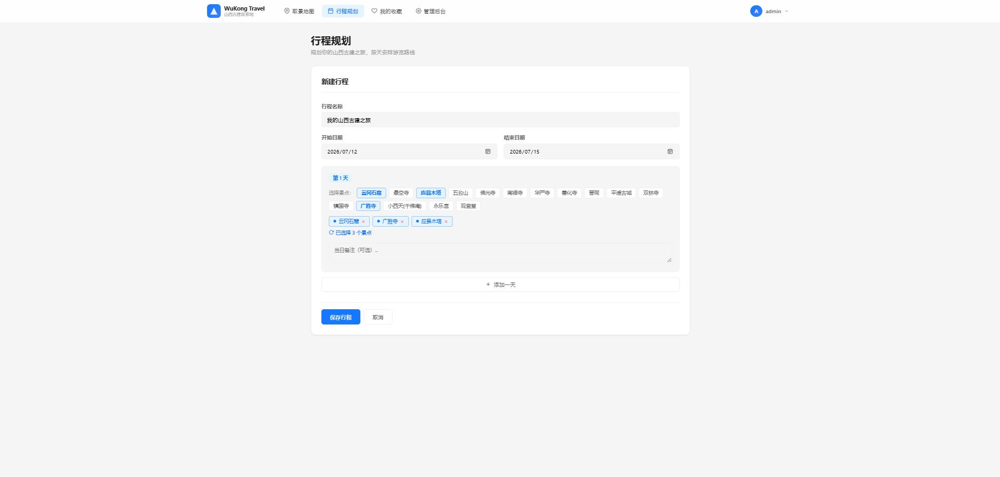

<p align="center">
  
  
  
  
  
  
</p>

<p align="center">
  <h1 align="center">WuKong Travel · 黑神话山西取景地旅游规划平台</h1>
  <p align="center">一个面向 <b>WebGIS 实习岗位</b> 的全栈简历项目</p>
  <p align="center">Vue 3 + 高德地图 JS API + Express + Prisma + SQLite</p>
</p>

---

## 关于本项目

这是一个专为 **WebGIS 前端开发实习岗位** 准备的简历项目。项目以《黑神话：悟空》在山西的 16 个取景地为主题，构建了一个集**地图可视化、空间分析、路径规划、旅游规划**于一体的全栈 WebGIS 平台。

> **AI 辅助声明**：本项目的部分代码（包括 UI 布局、高德 API 集成、部分后端逻辑）由 deepseekV4 pro辅助生成，本人负责需求设计、代码审查、调试优化和功能整合。项目中的核心 GIS 知识（坐标系、缓冲区分析、路径规划等）和全栈架构设计均由本人独立学习掌握。

---

## 项目展示

| | |
|:---:|:---:|
| **主页面** | **缓冲区分析** |
|  |  |
| **路径规划** | **实时天气** |
|  |  |
| **行程规划** | |
|  | |

---

## 技术栈

| 层级 | 技术 | 选型理由 |
|------|------|---------|
| **前端框架** | Vue 3 + Composition API | 组件化开发，TypeScript 支持完善 |
| **状态管理** | Pinia | Vue 3 官方推荐，轻量且类型安全 |
| **路由** | Vue Router 4 | SPA 路由 + 导航守卫 |
| **GIS 引擎** | 高德地图 JS API v2.0 | 中国 POI 数据最全，空间分析插件丰富 |
| **HTTP 客户端** | Axios | 拦截器统一处理 Token 和错误 |
| **后端框架** | Express | 轻量灵活，Node.js 生态成熟 |
| **ORM** | Prisma | 类型安全，自动迁移，开发效率高 |
| **数据库** | SQLite（开发）/ PostgreSQL（生产） | 零配置演示，可平滑升级到 PostGIS |
| **认证** | JWT + bcrypt | 无状态认证，安全性行业标准 |
| **构建工具** | Vite | 毫秒级冷启动，HMR 极速热更新 |
| **语言** | TypeScript（全栈） | 类型安全贯穿前后端 |

---

## 核心功能

###  GIS 空间能力

| 功能 | 技术实现 | 用户价值 |
|------|---------|---------|
| **地图可视化** | 高德 JS API v2.0，自定义 Marker 样式，16 个取景地标注 | 直观展示取景地空间分布 |
| **实时天气查询** | AMap.Weather 插件，实时温湿度/风向风力 | 辅助出行决策 |
| **驾车路径规划** | AMap.Driving，支持多策略规划，距离/时间/通行费计算 | 取景地间导航 |
| **缓冲区分析** | AMap.Circle 绘制 + AMap.PlaceSearch 周边搜索 | 服务站/停车场/加油站等 POI 发现 |
| **POI 到景点导航** | 点击缓冲区 POI 一键规划到取景地路线 | 最后一公里出行 |
| **空间搜索** | AMap.Geocoder 地址解析 + 逆地理编码 | 地址 ↔ 坐标互转 |

###  业务功能

| 模块 | 功能 | 技术实现 |
|------|------|---------|
| **取景地管理** | 16 个取景地 CRUD、搜索筛选、城市过滤 | RESTful API + 动态查询 |
| **用户系统** | 注册/登录，JWT 认证，角色权限（admin/user） | bcrypt 加密 + Bearer Token |
| **收藏系统** | 收藏/取消收藏，地图标记联动 | Pinia 状态管理 + 标记颜色联动 |
| **评价系统** | 1-5 星评分 + 文字评价 | upsert 模式（有则更新无则创建） |
| **行程规划** | 多日行程创建/编辑，拖拽排序 | 复合表单 + 动态天数管理 |
| **管理后台** | 数据看板、取景地 CRUD、用户管理 | 角色中间件 + 分页查询 |

---

## 数据模型

```prisma
User ──┬── Favorite ──┬── Location
       │               │
       ├── Review ─────┘
       │
       └── Itinerary ── ItineraryDay
```

| 模型 | 字段 | 说明 |
|------|------|------|
| `Location` | name, city, district, lng, lat, tags, period, description, ticket, hours, bestSeason, highlight, images | 16 个山西取景地预置数据 |
| `User` | username, email, password, role, avatar | bcrypt 加密，admin/user 角色 |
| `Favorite` | userId, locationId | 联合唯一约束 |
| `Review` | userId, locationId, rating, content | 一人一景一条评价 |
| `Itinerary` | userId, title, startDate, endDate | 行程主表 |
| `ItineraryDay` | itineraryId, dayIndex, locationIds | locationIds 存为 JSON 数组 |

---

## 快速开始

### 环境要求

- Node.js >= 18
- npm >= 9

### 本地开发

```bash
# 1. 克隆项目
git clone https://github.com/<your-username>/wukong-travel.git
cd wukong-travel

# 2. 安装后端依赖 + 初始化数据库
cd server
npm install
npx prisma generate
npx prisma db push
npm run db:seed

# 3. 安装前端依赖
cd ../client
npm install

# 4. 启动开发环境（需要两个终端）
# 终端 1 — 后端 :3721
cd server && npm run dev

# 终端 2 — 前端 :5173
cd client && npm run dev

# 5. 打开浏览器访问
# http://localhost:5173
```

### 默认账号

| 角色 | 用户名 | 密码 |
|------|--------|------|
| 管理员 | `admin` | `admin123` |
| 普通用户 | 注册即可 | — |

---

## 项目结构

```
wukong-travel/
├── client/                          # 前端 SPA
│   ├── src/
│   │   ├── api/index.ts            # Axios 封装 + 拦截器
│   │   ├── stores/                 # Pinia 状态管理
│   │   │   ├── auth.ts            # 用户认证
│   │   │   └── locations.ts       # 取景地/收藏/评价
│   │   ├── router/index.ts        # 路由 + 导航守卫
│   │   ├── types/index.ts         # TypeScript 类型定义
│   │   ├── utils/toast.ts         # 轻量 Toast 组件
│   │   ├── styles/global.css      # 全局样式 + CSS 变量
│   │   ├── views/                 # 8 个页面组件
│   │   │   ├── MapView.vue        # ★ 核心地图页（GIS 交互）
│   │   │   ├── LocationDetail.vue # 取景地详情 + 评价
│   │   │   ├── ItineraryView.vue  # 行程规划编辑器
│   │   │   ├── AdminView.vue      # 管理后台
│   │   │   └── ...                # 登录/注册/收藏/SEO
│   │   ├── App.vue                # 根组件 + 导航栏
│   │   └── main.ts                # 入口
│   ├── index.html                 # 高德 API Key 配置
│   └── vite.config.ts             # Vite + 代理配置
│
├── server/                          # 后端 REST API
│   ├── prisma/
│   │   ├── schema.prisma          # 6 张表数据模型
│   │   └── dev.db                 # SQLite 数据库
│   ├── src/
│   │   ├── index.ts               # Express 入口
│   │   ├── db.ts                  # Prisma 客户端
│   │   ├── seed.ts                # 16 取景地 + 管理员初始化
│   │   ├── middleware/            # 中间件
│   │   │   ├── auth.ts           # JWT + 角色鉴权
│   │   │   ├── error.ts          # 全局错误处理
│   │   │   └── logger.ts         # 请求日志
│   │   └── routes/               # 6 组路由
│   │       ├── auth.ts           # 注册/登录
│   │       ├── locations.ts      # 取景地 CRUD
│   │       ├── favorites.ts      # 收藏管理
│   │       ├── reviews.ts        # 评价系统
│   │       ├── itineraries.ts    # 行程规划
│   │       └── dashboard.ts      # 管理后台
│   └── .env
│
└── README.md                       # 本文件
```

---

## API 接口

```
基础路径: http://localhost:3721/api

认证
POST   /auth/register           注册
POST   /auth/login              登录
GET    /auth/me                 当前用户

取景地
GET    /locations               列表（?city=&tag=&search=）
GET    /locations/:id           详情
POST   /locations               新增（admin）
PUT    /locations/:id           编辑（admin）
DELETE /locations/:id           删除（admin）

收藏
GET    /favorites               我的收藏
POST   /favorites/:locationId   切换收藏

评价
GET    /reviews/location/:lid   取景地评价
POST   /reviews/:locationId     提交评价
DELETE /reviews/:id             删除评价

行程
GET    /itineraries             我的行程
POST   /itineraries             创建行程
PUT    /itineraries/:id         编辑行程
DELETE /itineraries/:id         删除行程

管理
GET    /dashboard/stats         概览统计
GET    /dashboard/locations     取景地管理
GET    /dashboard/users         用户管理
```

---

## 技术亮点

### GIS 核心能力
- **坐标系**：高德 GCJ-02，坐标偏移处理
- **缓冲区分析**：AMap.Circle 几何绘制 + PlaceSearch 周边 POI 检索
- **路径规划**：AMap.Driving 驾车导航，多策略支持，距离/时间/费用计算
- **空间查询**：AMap.Geocoder 地址地理编码 + 逆地理编码
- **天气集成**：AMap.Weather 实时气象数据获取

### 后端架构
- **分层设计**：路由层 → 业务逻辑层 → ORM 层 → 数据库
- **JWT 无状态认证**：Bearer Token，支持过期刷新
- **三级权限**：公开接口 / 登录用户 / 管理员
- **Zod 运行时校验**：API 入口统一参数验证
- **Prisma 类型安全**：编译时检查 SQL 查询，避免运行时错误

### 前端工程化
- **路由懒加载**：8 个页面按需加载，首屏优化
- **Pinia 响应式缓存**：取景地列表全局共享，避免重复请求
- **Axios 拦截器**：统一 Token 注入 + 401 自动跳转登录
- **CSS 变量体系**：统一设计 Token，支持主题切换

---

## 个人收获

通过这个项目，我系统掌握了以下 WebGIS 开发技能：

1. **GIS 基础知识**：理解坐标系（WGS84/GCJ-02）、瓦片地图、空间数据可视化原理
2. **高德地图 API**：熟练使用 Marker、InfoWindow、Circle、Geocoder、Driving、Weather、PlaceSearch 等核心模块
3. **全栈开发能力**：从数据库设计到前端交互，独立完成端到端功能开发
4. **Vue 3 生态**：Composition API、Pinia、Vue Router 的实际项目应用
5. **TypeScript 实践**：全栈类型安全，提升代码质量和开发效率
6. **工程化思维**：项目结构设计、API 设计规范、错误处理策略

---

## 后续规划

- [ ] 升级到 PostgreSQL + PostGIS，支持空间索引和空间查询
- [ ] 引入 Cesium.js 实现取景地 3D 地形可视化
- [ ] ECharts 数据看板，展示取景地热力图和用户画像
- [ ] 路线优化算法（TSP），求解多取景地最优游览路线
- [ ] 迁移到 Nuxt 3 实现 SSR，解决 SEO 问题
- [ ] 添加单元测试（Vitest）和 E2E 测试（Playwright）
- [ ] GitHub Actions CI/CD 自动部署

---

## License

MIT License

---

<p align="center">
  <sub>一个 WebGIS 初学者的成长之路 · 欢迎 Star ⭐ 和交流</sub>
</p>
