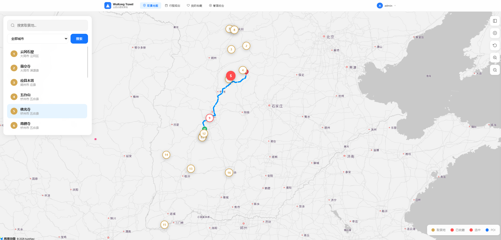
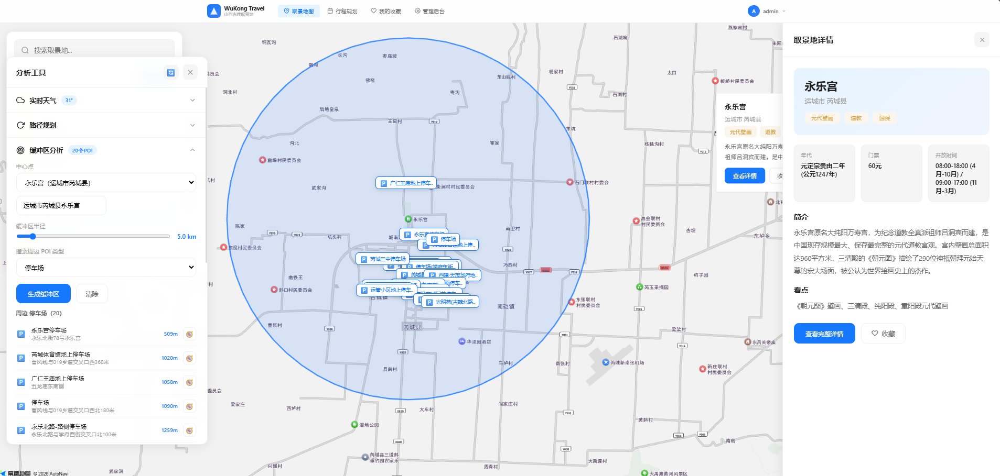
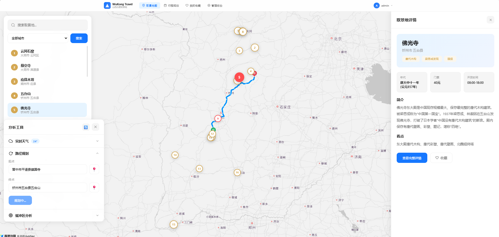
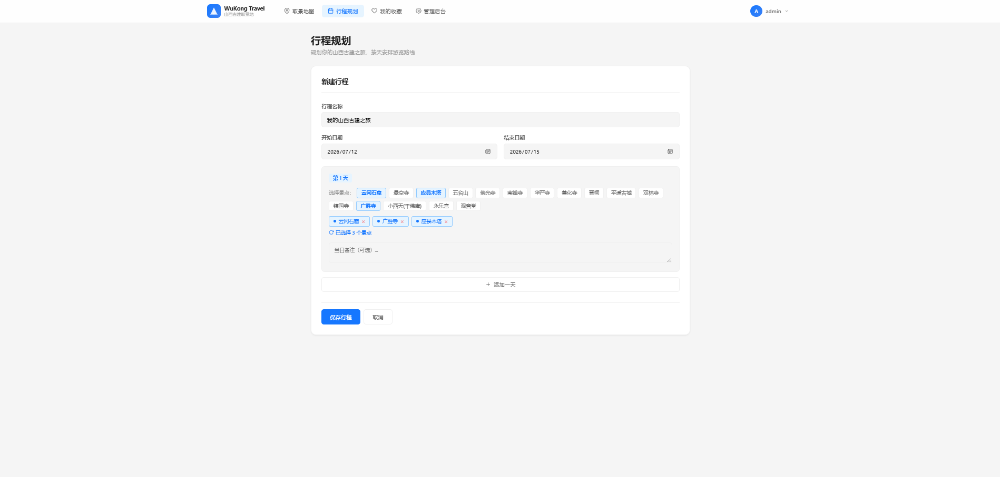

<p align="center">
  
  
  
  
  
  
  
  
</p>

<p align="center">
  <h1 align="center">WuKong Travel · 黑神话山西取景地旅游规划平台</h1>
  <p align="center">一个面向 <b>WebGIS 岗位</b> 的全栈项目</p>
  <p align="center">Vue 3 + CesiumJS / OpenLayers + Turf.js + Flask + PostgreSQL/PostGIS</p>
</p>

---

## 关于本项目

以《黑神话：悟空》在山西的 16 个取景地为主题，构建集 **3D 地形可视化、空间分析、路径规划、缓冲区分析、旅游规划** 于一体的全栈 WebGIS 平台。

---

## 项目展示

| | |
|:---:|:---:|
| **主页面** | **缓冲区分析** |
|  |  |
| **路径规划** | **3D 地形** |
|  | |
| **行程规划** | |
|  | |

---

## 技术栈

| 层级 | 技术 | 说明 |
|------|------|------|
| **前端框架** | Vue 3 + Composition API | TypeScript 支持完善 |
| **状态管理** | Pinia | Vue 3 官方推荐 |
| **路由** | Vue Router 4 | SPA 路由 + 导航守卫 |
| **3D GIS** | CesiumJS | 3D Tiles 地形渲染、glTF 模型、3D 标注 |
| **2D GIS** | OpenLayers | OSM/卫星底图、矢量图层、WMS/WFS |
| **空间分析(前端)** | Turf.js | 缓冲区、距离计算、坐标转换 (EPSG:4326/3857) |
| **HTTP 客户端** | Axios | 拦截器统一 Token/错误处理 |
| **后端框架** | Flask | RESTful API 设计 |
| **ORM** | SQLAlchemy + GeoAlchemy2 | 支持 PostGIS 空间字段 |
| **数据库** | PostgreSQL + PostGIS | 空间索引、空间查询 (ST_DWithin 等) |
| **空间分析(后端)** | GeoPandas + Shapely + NetworkX | 缓冲区分析、网络最短路径、空间优化 |
| **坐标转换** | pyproj | EPSG:4326 ↔ 3857 |
| **认证** | JWT + bcrypt | 无状态认证 |
| **构建工具** | Vite | HMR 热更新 |
| **容器化** | Docker Compose | PostgreSQL + Flask + Vue 一键部署 |

---

## 核心功能

### GIS 空间能力

| 功能 | 前端技术 | 后端技术 |
|------|---------|---------|
| **3D 地形可视化** | CesiumJS (Cesium World Terrain / EllipsoidTerrain) | — |
| **2D 地图展示** | OpenLayers (OSM / ArcGIS 卫星影像) | — |
| **缓冲区分析** | Turf.js `@turf/circle` + `@turf/pointsWithinPolygon` | GeoPandas + Shapely buffer |
| **最短路径** | Turf.js `@turf/distance` + 贪心最近邻 | NetworkX shortest_path |
| **坐标转换** | Turf.js 手动投影计算 | pyproj EPSG:4326/3857 |
| **空间数据导出** | — | GeoJSON / Shapefile |
| **空间查询** | — | PostGIS ST_DWithin 半径查询 |

### 业务功能

| 模块 | 功能 | 技术 |
|------|------|------|
| **取景地管理** | 16 个取景地 CRUD、搜索筛选 | RESTful API + 空间查询 |
| **用户系统** | 注册/登录，JWT 认证，角色权限 | bcrypt + Bearer Token |
| **收藏系统** | 收藏/取消收藏，地图联动 | Pinia 状态管理 |
| **评价系统** | 1-5 星评分 + 文字评价 | upsert 模式 |
| **行程规划** | 多日行程创建/编辑，拖拽排序 | 复合表单 + 动态管理 |
| **管理后台** | 数据看板、取景地/用户管理 | 分页查询 + 角色鉴权 |

---

## 数据模型

```
User ──┬── Favorite ──┬── Location (geom: PostGIS POINT, SRID=4326)
       │               │
       ├── Review ─────┘
       │
       └── Itinerary ── ItineraryDay
```

| 模型 | 核心字段 | 说明 |
|------|------|------|
| `Location` | name, city, lng, lat, **geom(POINT,4326)**, tags, description | 16 个山西取景地，PostGIS 空间字段 |
| `User` | username, email, password, role | bcrypt 加密 |
| `Favorite` | userId, locationId | 联合唯一约束 |
| `Review` | userId, locationId, rating, content | 一人一景一条评价 |
| `Itinerary` | userId, name, startDate, endDate | 行程主表 |
| `ItineraryDay` | itineraryId, dayNumber, locationIds | locationIds JSON 数组 |

---

## 快速开始

### 环境要求

- Node.js >= 18
- Python >= 3.11
- PostgreSQL >= 15 + PostGIS >= 3.4 (或 Docker)

### 本地开发

```bash
# 1. 克隆项目
git clone <repo-url>
cd wukong-travel

# 2. 启动 PostgreSQL + PostGIS
docker-compose up -d postgres

# 3. 安装后端依赖 + 初始化
cd server
pip install -r requirements.txt
flask db init
flask db migrate -m "init"
flask db upgrade
python seed.py

# 4. 安装前端依赖
cd ../client
npm install

# 5. 启动开发环境（两个终端）
# 终端 1 — 后端 :3721
cd server && python app.py

# 终端 2 — 前端 :5173
cd client && npm run dev

# 6. 访问
# http://localhost:5173
```

### Docker 一键启动

```bash
docker-compose up -d
```

### 默认账号

| 角色 | 用户名 | 密码 |
|------|--------|------|
| 管理员 | `admin` | `admin123` |

> 生产环境请修改密码和 JWT_SECRET。

---

## 项目结构

```
wukong-travel/
├── client/                             # Vue 3 前端
│   ├── src/
│   │   ├── api/index.ts               # Axios 封装
│   │   ├── components/
│   │   │   ├── cesium/CesiumViewer.vue # CesiumJS 3D 地球组件
│   │   │   ├── openlayers/OLViewer.vue # OpenLayers 2D 地图组件
│   │   │   └── Toast.vue              # 消息提示组件
│   │   ├── stores/                    # Pinia 状态管理
│   │   ├── router/index.ts           # 路由 + 导航守卫
│   │   ├── types/index.ts            # TypeScript 类型
│   │   ├── utils/
│   │   │   ├── spatial.ts            # Turf.js 空间分析工具
│   │   │   └── toast.ts              # Toast 工具
│   │   ├── styles/global.css         # CSS 变量 + 全局样式
│   │   └── views/                    # 页面组件
│   │       ├── MapView.vue           # ★ 核心地图页 (3D/2D 切换)
│   │       ├── LocationDetail.vue    # 取景地详情
│   │       ├── ItineraryView.vue     # 行程规划
│   │       └── ...
│   ├── vite.config.ts                # Vite + Cesium 插件
│   └── index.html
│
├── server/                             # Flask 后端
│   ├── app.py                        # Flask 应用工厂
│   ├── config.py                     # 配置 (DB/JWT/CORS)
│   ├── models/                       # SQLAlchemy 模型 (PostGIS)
│   │   ├── user.py
│   │   ├── location.py              # geom 字段
│   │   └── ...
│   ├── routes/                       # Blueprint 路由
│   │   ├── auth.py                  # 注册/登录
│   │   ├── locations.py             # 取景地 CRUD + 空间查询
│   │   ├── spatial.py               # 空间分析 API
│   │   └── ...
│   ├── services/
│   │   └── spatial_service.py       # GeoPandas/Shapely/NetworkX 分析
│   ├── utils/auth.py                # JWT 认证装饰器
│   ├── seed.py                      # 16 取景地 + 管理员初始化
│   └── requirements.txt
│
├── data/                              # 空间数据文件
│   ├── geojson/locations.geojson    # 16 取景地 (EPSG:4326)
│   └── shapefile/                   # Shapefile 数据目录
│
├── docker-compose.yml                # PostgreSQL + Flask + Vue
└── README.md
```

---

## API 接口

```
基础路径: http://localhost:3721/api

认证
POST   /auth/register           注册
POST   /auth/login              登录
GET    /auth/me                 当前用户
PUT    /auth/profile            更新资料

取景地
GET    /locations               列表 (?city=&search=)
GET    /locations/:id           详情
POST   /locations               新增 (admin)
PUT    /locations/:id           编辑 (admin)
DELETE /locations/:id           删除 (admin)

空间分析 ★
GET    /spatial/geojson/locations   导出 GeoJSON
GET    /spatial/shortest-path       最短路径 (?start=&end=)
GET    /spatial/buffer              缓冲区分析 (?lng=&lat=&radius=)
GET    /spatial/transform           坐标转换 (?lng=&lat=&from=4326&to=3857)
GET    /spatial/distance            距离计算 (?lng1=&lat1=&lng2=&lat2=)
GET    /spatial/optimize            空间优化采样 (?count=5)

收藏
GET    /favorites               我的收藏
POST   /favorites/:locationId   切换收藏

评价
GET    /reviews/location/:lid   取景地评价
POST   /reviews/:locationId     提交评价
DELETE /reviews/:id             删除评价

行程
GET    /itineraries             我的行程
POST   /itineraries             创建行程
PUT    /itineraries/:id         编辑行程
DELETE /itineraries/:id         删除行程

管理
GET    /dashboard/stats         概览统计
GET    /dashboard/locations     取景地管理
GET    /dashboard/users         用户管理
```

---

## 技术要点

### WebGIS / 空间数据

- **坐标系**: EPSG:4326 (WGS84) ↔ EPSG:3857 (Web Mercator)，前端 Turf.js + 后端 pyproj 双重支持
- **空间索引**: PostGIS GIST 索引，加速空间查询
- **缓冲区分析**: 前端 `@turf/circle` + 后端 Shapely `buffer()`，投影变换保证米级精度
- **路径规划**: NetworkX 构建距离加权图，Dijkstra 最短路径 + Turf.js 前端可视化
- **空间数据格式**: GeoJSON (EPSG:4326) 标准交换格式，支持 Shapefile 导入导出

### 后端架构

- **应用工厂模式**: Flask `create_app()` 延迟初始化
- **JWT 无状态认证**: 7 天过期，三层权限（公开/登录/管理员）
- **Flask-Migrate**: 数据库迁移管理
- **GeoAlchemy2**: ORM 映射 PostGIS 空间字段

### 前端工程化

- **路由懒加载**: 页面按需加载
- **Pinia 响应式缓存**: 全局共享数据
- **Axios 拦截器**: 统一 Token 注入 + 401 跳转
- **CSS 变量体系**: 可扩展设计系统
- **vite-plugin-cesium**: Cesium 静态资源自动处理

---

## License

MIT License
