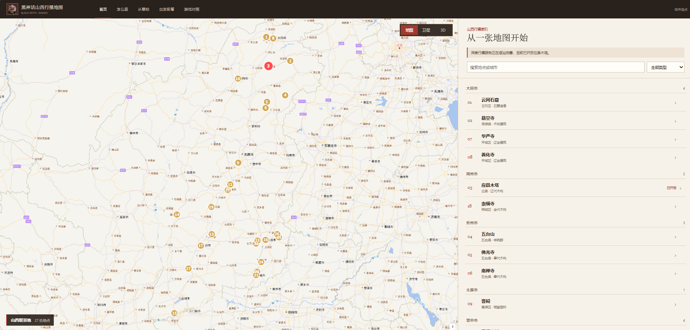
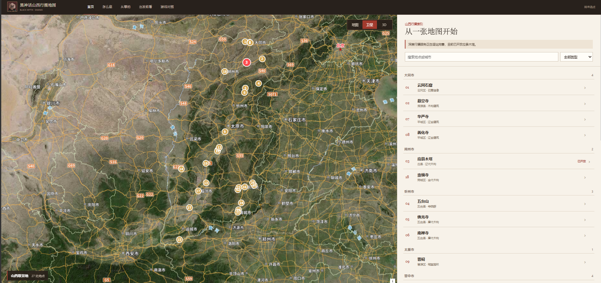
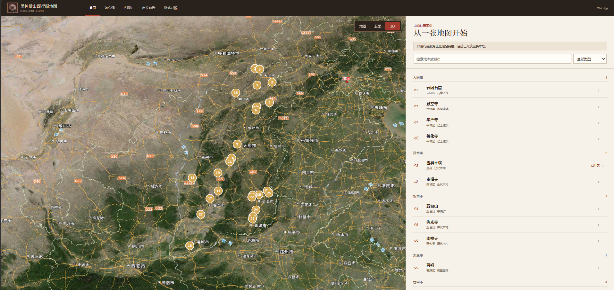
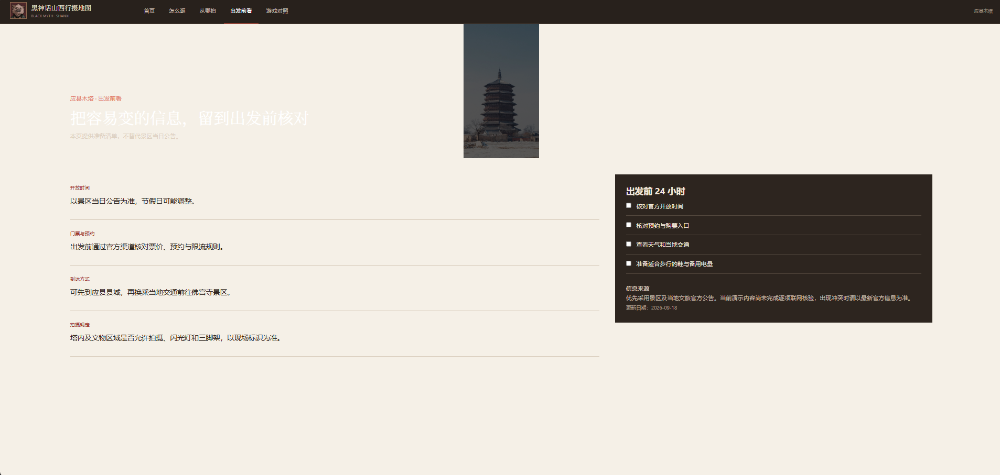
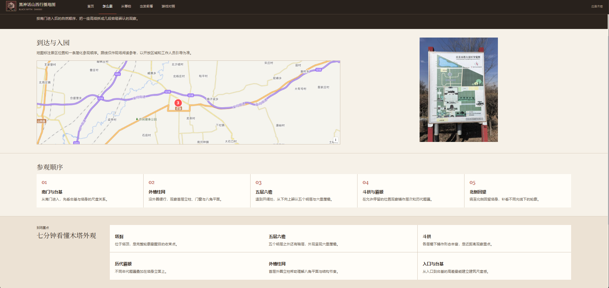
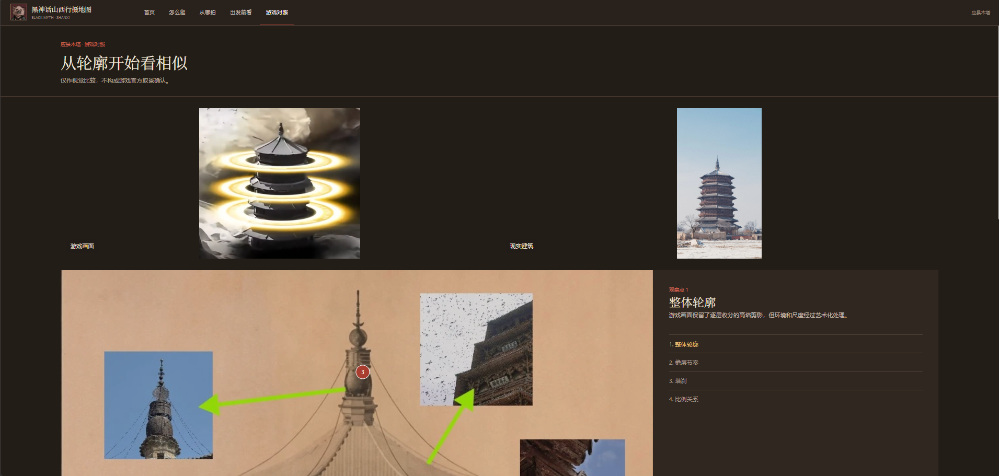
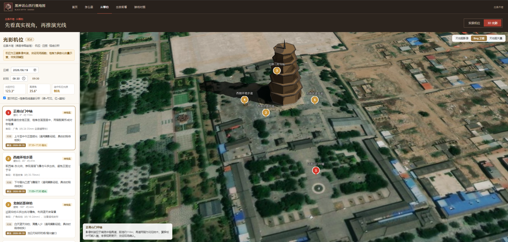
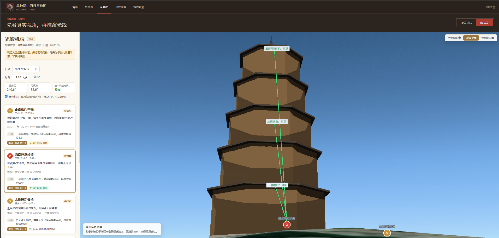

<p align="center">
  
  
  
  
  
  
  
</p>

<p align="center">
  <h1 align="center">WuKong Travel · 黑神话山西行摄地图</h1>
  <p align="center">一个面向 <b>WebGIS 岗位</b> 的全栈项目</p>
  <p align="center">核心亮点：CesiumJS 三维光影分析（太阳轨迹 · 实时阴影 · 机位视线通廊）</p>
</p>

---

## 关于本项目

以《黑神话：悟空》在山西的 **27 处**取景地为线索的行摄工具站，回答四个实际问题：**去哪拍、怎么逛、出发前要核对什么、游戏里的建筑对应现实中的什么**。

项目最主要的功能是「**从哪拍 · 3D 光影**」：在 CesiumJS 场景里按真实坐标参数化重建应县木塔体量，用确定性的太阳算法模拟任意日期/时刻的日照，给出每个机位的顺光/逆光时段，并自动分析机位到塔身各层的视线是否被遮挡。

---

## 项目展示

| 首页 · 27 处取景地总表（矢量地图 + 索引） | 首页 · 卫星影像模式 |
|:---:|:---:|
|  |  |
| **首页 · 3D 地形图层** | **出发前看 · 开放/门票/预约/拍摄信息核对** |
|  |  |
| **怎么逛 · 应县木塔参观顺序** | **游戏对照 · 轮廓与结构讲解** |
|  |  |
| **光影机位 · 09:30 木塔阴影与机位总览** | **光影机位 · 15:30 顺光机位视线通廊** |
|  |  |

---

## 核心功能

### ★ 3D 光影机位分析（核心亮点）

入口：导航「从哪拍」→「3D 光影」标签。以应县木塔为试点，全部算法确定性计算，不依赖任何 AI 服务。

| 能力 | 实现方式 |
|------|---------|
| **太阳位置计算** | 纯函数实现 NOAA 太阳位置公式（±0.1°），给定日期/时刻/经纬度算出太阳方位角与高度角，独立于 Cesium，可单测 |
| **参数化建筑体量** | 木塔按真实中心坐标（OSM 八角轮廓 + 天地图影像目视核对）生成台基、五个明层、外挑檐带与塔刹，落在 Cesium World Terrain 真实地形上；明确标注「体量示意，非实测模型」 |
| **实时日照阴影** | 场景时钟随日期/时刻滑块驱动，`enableLighting` + ShadowMap 渲染木塔投影；实测 08:00 影长朝西约 180m、正午约 50m、17:00 朝东约 220m |
| **机位数据** | 5 个机位（坐标、拍摄朝向、构图、建议焦段），按卫星影像判读可站立、不被配殿院墙遮挡的位置，全部诚实标注「影像判读、未现场踏勘」 |
| **视线通廊分析** | 机位到塔身三个高度目标（一层檐口 / 三层塔身 / 塔刹下）做可见性判定：ENU 局部坐标系下线-圆柱求交查体量遮挡，`globe.pick` 射线查地形遮挡，绿线可见、红线标遮挡物 |
| **拍摄时段推荐** | 以「太阳在机位背后直射被摄面」为顺光判据，逐半小时打分（顺光/侧光/逆光），合并出推荐窗口，与游记经验时段并排对照 |
| **实景机位** | 「实景机位」标签提供实地照片、构图说明与建议步行顺序，先看真实视角再看光线推演 |
| **底图切换** | 天地图影像（含中文注记）/ Bing 卫星（Cesium Ion）/ 天地图矢量，加载失败自动降级 OSM |

### 取景地总表与地图（首页）

- 山西 27 处取景地索引，按城市分组，支持关键词搜索与建筑类型筛选
- 地图三种模式：2D 矢量、卫星影像、3D 地形（OpenLayers 与 CesiumJS 共用一份点位数据）
- 底图统一为天地图，选中取景地后进入对应的内容服务

### 怎么逛

- 到达与入园（区位地图 + 景区导览图）、按自然顺序拆解的五步参观路线
- 「七分钟看懂木塔外观」：塔刹、五层六檐、历代匾额、外槽柱网、斗拱、入口台基

### 出发前看（防白跑）

- 开放时间、门票与预约方式、到达方式、拍摄规定（闪光灯/三脚架以现场标识为准）
- 出发前 24 小时核对清单；易变信息只做清单提示，不代替景区当日公告

### 游戏对照

- 游戏画面与现实建筑的轮廓、塔刹、斗拱分层对照，并明确标注「仅作视觉比较，不构成官方取景确认」

### 辅助功能

- 古建知识字典、用户注册/登录、取景地收藏与评价、采编工作台（演示）

---

## 技术栈

| 层级 | 技术 | 用途 |
|------|------|------|
| 前端框架 | Vue 3 + Composition API + TypeScript | 组合式开发，类型约束 |
| 状态管理 / 路由 | Pinia / Vue Router 4 | 全局状态、页面懒加载 |
| **3D GIS** | **CesiumJS** | 地形影像、参数化建筑体量、日照阴影、视线分析、相机飞行 |
| **2D GIS** | **OpenLayers** | 天地图矢量/卫星底图、点位与矢量图层 |
| 地图服务 | 天地图 WMTS / DataServer、Cesium Ion（World Terrain、Bing 影像） | 底图与地形，密钥经 `.env.local` 注入 |
| 后端 | Flask 3 + SQLAlchemy + GeoAlchemy2 | 用户、取景地、收藏、评价、行程、管理接口 |
| 数据库 | PostgreSQL 16 + PostGIS | 空间字段与空间索引 |
| 认证 | JWT + bcrypt | 无状态登录 |
| 构建 / 部署 | Vite、Docker Compose | Cesium 独立 chunk 懒加载；单机 Nginx + Flask + PG 部署 |

> 前端内置静态数据（`client/src/data/`），后端未启动时页面仍可完整浏览，接口失败自动兜底。

---

## 数据口径

- `client/src/data/demo.ts`：27 处取景地索引（坐标、城市、类型）
- `client/src/data/yingxian.ts`：应县木塔实景机位照片与参观素材
- `client/src/data/photoSpots.ts`：木塔体量参数与 5 个光影机位
- 木塔中心（113.181998, 39.565265）、八角外接直径约 33.7m、总高 67.31m 来自 OpenStreetMap（ODbL 署名）并经天地图 z18 影像目视核对；机位坐标为影像判读，标「待核实」，未现场踏勘前不冒充精确数据
- 天地图 key 与 Cesium Ion token 仅存在于 `client/.env.local`（已 gitignore），仓库中不包含任何密钥

---

## 快速开始

### 环境要求

- Node.js >= 18
- Python >= 3.11（仅后端需要）
- PostgreSQL 16 + PostGIS（或 Docker）

### 前端（不启动后端也能浏览全部页面）

```bash
cd client
npm install

# 配置地图密钥（可选，不配置时 3D 光影降级为椭球面 + OSM 底图）
# client/.env.local
# VITE_TIANDITU_KEY=你的天地图key
# VITE_CESIUM_ION_TOKEN=你的ion_token

npm run dev      # http://localhost:5173
```

### 后端（用户/收藏/评价/行程等接口）

```bash
cd server
pip install -r requirements.txt
flask db init && flask db migrate -m "init" && flask db upgrade
python seed.py
python app.py    # http://localhost:3721
```

### 默认账号

| 角色 | 用户名 | 密码 |
|------|--------|------|
| 管理员 | `admin` | `admin123` |

> 生产环境请修改默认密码与 JWT 密钥。

---

## 项目结构

```
wukong-travel/
├── client/
│   ├── src/
│   │   ├── components/
│   │   │   ├── cesium/
│   │   │   │   ├── CesiumViewer.vue      # 首页 3D 地图（点位、地形）
│   │   │   │   └── PhotoSpot3D.vue       # ★ 光影机位三维场景（体量/阴影/视线）
│   │   │   └── openlayers/OLViewer.vue   # 2D 矢量/卫星地图
│   │   ├── data/                         # 前端唯一数据源（静态 TS）
│   │   │   ├── demo.ts                   # 27 处取景地
│   │   │   ├── yingxian.ts               # 实景机位照片素材
│   │   │   └── photoSpots.ts             # 木塔体量参数 + 机位
│   │   ├── utils/sun.ts                  # ★ NOAA 太阳位置与光质评分（纯函数）
│   │   ├── views/
│   │   │   ├── PortalHomeView.vue        # 首页：地图 + 取景地索引
│   │   │   ├── PhotoGuideView.vue        # 从哪拍（实景机位 / 3D 光影 两个标签）
│   │   │   ├── PhotoSpotsView.vue        # ★ 光影机位页
│   │   │   ├── TourView.vue              # 怎么逛
│   │   │   ├── PracticalView.vue         # 出发前看
│   │   │   └── GameCompareView.vue       # 游戏对照
│   │   └── router/index.ts
│   └── .env.local                        # 地图密钥（gitignore，不入库）
├── server/
│   ├── routes/                           # auth/locations/favorites/reviews/...
│   ├── models/                           # SQLAlchemy + GeoAlchemy2
│   └── seed.py
├── visual/                               # README 展示截图（已去敏感信息）
└── README.md
```

---

## API 接口（后端，基础路径 `/api`）

```
认证
POST  /auth/register        注册
POST  /auth/login           登录
GET   /auth/me              当前用户
PUT   /auth/profile         更新资料

取景地
GET   /locations            列表（?city=&tag=&search=）
GET   /locations/:id        详情
POST  /locations            新增（管理员）
PUT   /locations/:id        编辑（管理员）
DELETE /locations/:id       删除（管理员）

收藏 / 评价
GET   /favorites            我的收藏
POST  /favorites/:id        收藏/取消收藏
GET   /reviews/location/:id 取景地评价
POST  /reviews/:id          提交评价

行程
GET   /itineraries          行程列表
POST  /itineraries          新建
PUT   /itineraries/:id      编辑
DELETE /itineraries/:id     删除

管理后台
GET   /dashboard/stats      概览统计
GET   /dashboard/locations  取景地管理
GET   /dashboard/users      用户管理
```

---

## License

MIT License
